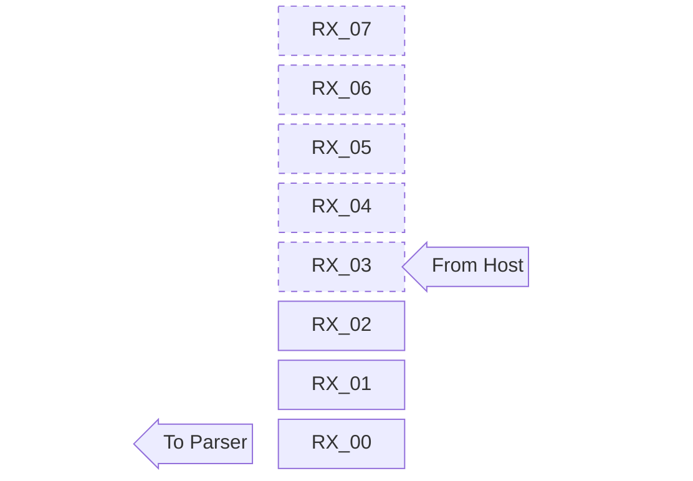
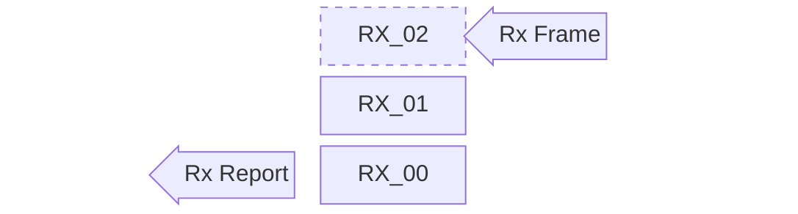
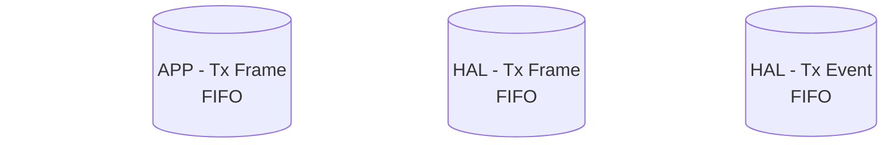
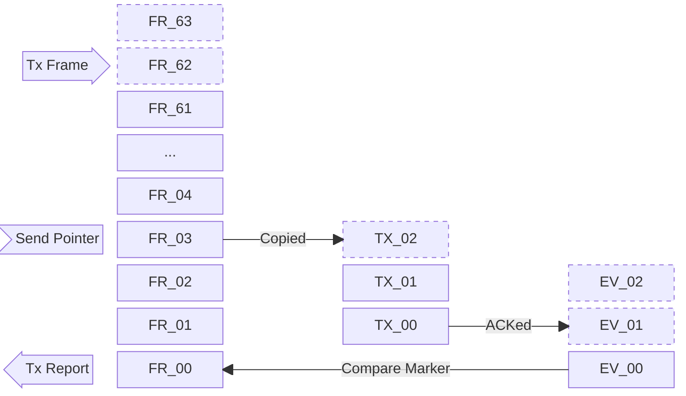

# Buffer strategy

This project put reliability over performance.
It would be better to delete whole message than passing corrupted data.
A corrupted data may cause unexpected device behavior or deceiving report.

## CDC Rx Buffer

## CDC Tx Buffer

## CAN Rx Buffer

## CAN Tx Buffer

