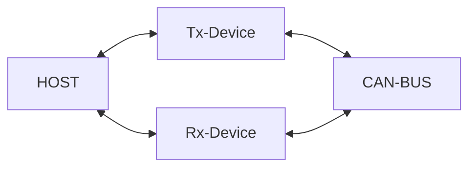

# Protocol design

There is not error detection mechanis such as check sum or CRC.
If a message is truncated, it may cause unexpected device behavior or deceiving report.
This will decrease the reliebility.

# Performance

The communication speed between the device and a host (e.g., a PC) is limited by the following factors:

- USB Full Speed, with a maximum speed of 12Mbps
- Text-based Communications Device Class protocol

As a result, the communication speed on the USB side is insufficient to fully transmit all data on the CAN FD bus.

The maximum speed on USB CDC is approximately 4Mbps (500kBytes/s) to 6Mbps (750kBytes/s), which corresponds to a 60% - 90% bus load on a 1Mbps/5Mbps CAN FD bus.
However, this value also depends on the process speed of the application in the host side.
Also, enabling Tx event reporting will consume more throughput since it requires bidirectional frame transmission (Tx command and Tx event).

If you attempt to transmit or receive more data than this limit, you will encounter message loss.
You can check for this loss using the `F` command.

Properly filtering CAN frames with the `W`, `M` and `m` commands will help reduce message flow and ensure that all necessary data is received. Spliting roles into multiple deviced will also work (e.g., One device for Rx and another for Tx).

If the required task does not fit in the capability of a device, you can:

- Use multiple device and split roles to them (see the next section)
- Switch to another device which supports High Speed USB
- Switch to efficient binary protocol

### Load balancing

