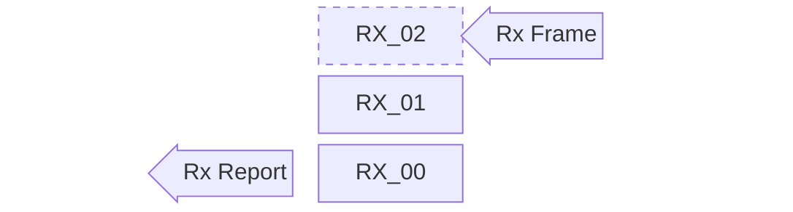

# Buffer strategy

This project put reliability over performance.

## CDC Rx Buffer

TODO

## CDC Tx Buffer

TODO

## CAN Rx Buffer

```mermaid
block
  columns 5
  space  space  RX[("<br>HAL-Rx Frame<br>FIFO?")]  space  space
```

```mermaid
block
  columns 5

  space  space                              RX_02  blockArrowId1<["Rx Frame"]>(left)  space
  space  space                              RX_01  space                              space
  space  blockArrowId2<["Rx Report"]>(left) RX_00  space                              space

  style RX_02 stroke-dasharray: 5 5
```

## CAN Tx Buffer

```mermaid
block
  columns 6
  space  FR[("<br>APP-Tx Frame<br>FIFO")]  space  TX[("<br>HAL-Tx Frame<br>FIFO")]  space  EV[("<br>HAL-Tx Event<br>FIFO")]
```

```mermaid
block
  columns 6

  space                              FR_63  space  space  space  space
  blockArrowId1<["Tx Frame"]>(right) FR_62  space  space  space  space
  space                              FR_61  space  space  space  space
  space                              ...    space  space  space  space
  space                              FR_04  space  space  space  space
  id5>"Send Pointer"]                FR_03  space  TX_02  space  space
  space                              FR_02  space  TX_01  space  EV_02
  space                              FR_01  space  TX_00  space  EV_01
  blockArrowId2<["Tx Report"]>(left) FR_00  space  space  space  EV_00

  FR_03 -- "Copied" --> TX_02
  TX_00 -- "ACKed" --> EV_01
  EV_00 -- "Compare Marker" --> FR_00

  style FR_63 stroke-dasharray: 5 5
  style FR_62 stroke-dasharray: 5 5
  style TX_02 stroke-dasharray: 5 5
  style EV_02 stroke-dasharray: 5 5
  style EV_01 stroke-dasharray: 5 5
```
