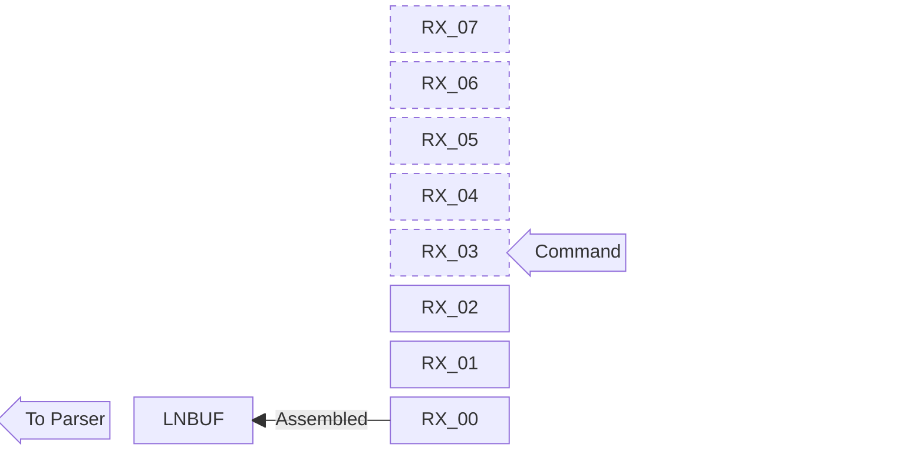
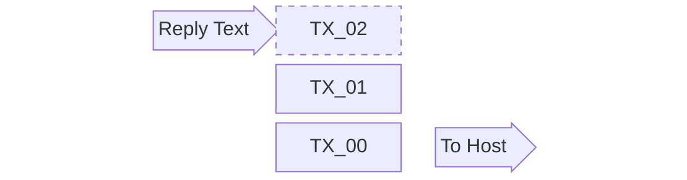
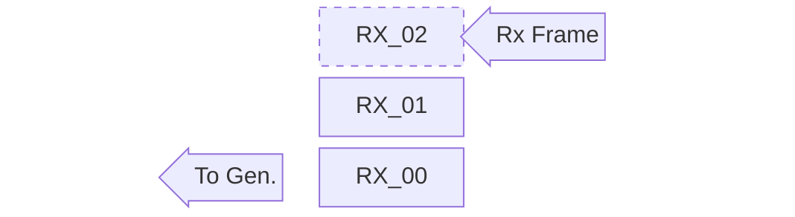
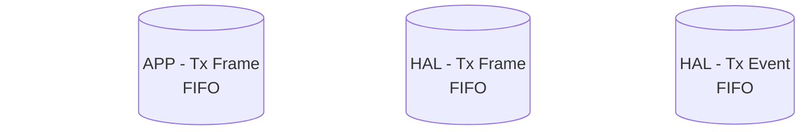
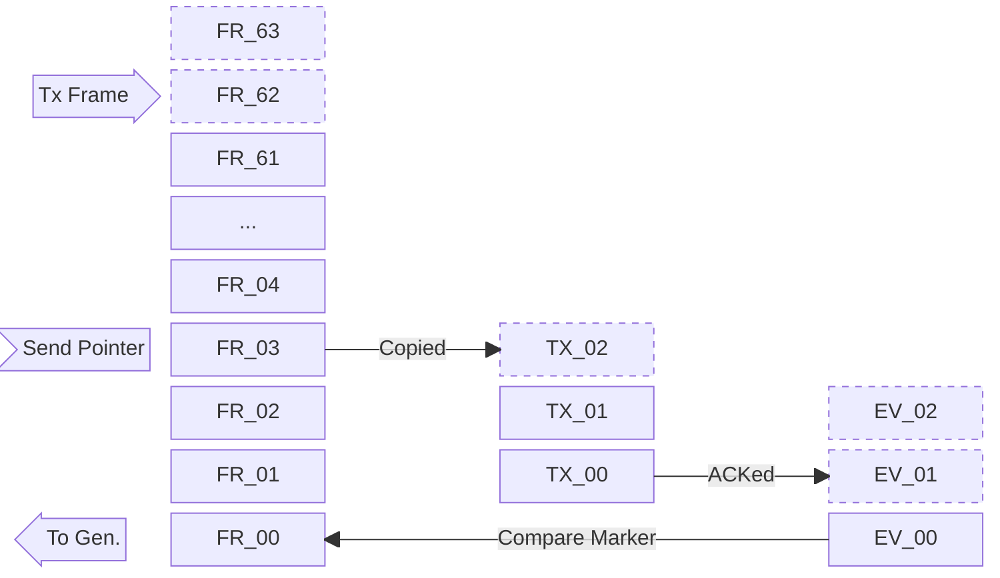

# Overview

This project puts reliability over performance.
It is better to discard an entire message than to pass corrupted data.
Such data may cause unexpected behavior or misleading reporting.

Each stage in the host-to-CAN-bus data path has its own buffer.
The sections below describe what flows through each buffer, how large
it is, and what happens when it overflows.
Buffer overflows surface to the host as bits in the `F` command status
flags; see the `F` command section in the Command List for the bit
assignments.

# CDC Rx Buffer

This FIFO holds raw text bytes received from the host over USB CDC,
waiting to be parsed into commands.
Each slot stores up to one USB packet (64 bytes).
The parser does not consume the FIFO directly: the firmware copies
bytes from the oldest FIFO slot into a **command line buffer**
(`LNBUF`, up to `SLCAN_MTU` bytes long) until a `[CR]` terminator
arrives, then hands the assembled command to the parser.
This indirection handles a single command split across multiple USB
packets and multiple commands packed into a single USB packet
equally well.

This FIFO holds up to 8 packets.
When the host sends data faster than the parser consumes it, the
producer marks the affected slot as torn.
The firmware then discards any in-progress contents of `LNBUF` and
skips bytes up to the next `[CR]` so that no torn data reaches the
parser.
The CAN Tx / CDC Rx overflow flag (`F` bit 1) is set so the host
can detect that one or more commands were dropped.

A command longer than `LNBUF` itself is rejected in the same spirit:
the firmware replaces the buffer with a single `[BELL]` byte, which
the parser echoes back as an error response when the eventual `[CR]`
arrives.

# CDC Tx Buffer

This FIFO holds reply text (command acknowledgements, Rx frame
reports, Tx events, status responses) waiting to be sent to the host
over USB CDC.

This FIFO holds up to 3 slots of 4 KB each.
When the buffer is full, a new report cannot be enqueued and is
dropped entirely rather than truncating an in-flight message;
this preserves message-level integrity at the cost of losing whole
reports.
The CAN Rx / CDC Tx overflow flag (`F` bit 0) is set so the host
can detect that one or more reports were dropped.
Hosts that observe this flag should reduce the rate at which they
generate reports (for example by tightening the acceptance filter,
disabling Tx event reporting, or splitting the load across multiple
devices; see the "Limitation" page).

# CAN Rx Buffer

This FIFO is the HAL-managed Rx FIFO of the FDCAN peripheral.
It holds incoming CAN FD frames received from the bus, waiting to
be picked up by the generator (`Gen.`).
The generator converts each frame into an Rx report and enqueues it
into the CDC Tx Buffer for transmission back to the host.

This FIFO holds up to 3 frames.
When the generator cannot drain it fast enough, the FDCAN peripheral
drops further incoming frames silently and the driver-side
frame-loss flag (`F` bit 3) is set.
Frames already in the FIFO at the moment of overflow are not
corrupted; only the frames received during the overrun condition
are lost.

# CAN Tx Buffer

This pipeline transports a Tx command from the parser to the CAN bus
and produces a Tx event report (when enabled).
It uses three stages:

1. **APP Tx Frame FIFO** is a software circular FIFO into which the
   parser places frames as they arrive from the host.  Each frame is
   tagged with a monotonically incrementing marker at this point, so
   that the marker-compare mechanism (described below) can later
   determine the fate of each frame.  This stage also decouples the
   host's command rate from the FDCAN transmission rate.
2. **HAL Tx Frame FIFO** is the FDCAN peripheral's hardware Tx FIFO.
   The firmware advances a *Send Pointer* through the APP FIFO and
   copies each frame here as space becomes available, checking the
   HAL free-level first to avoid overflowing it.
3. **HAL Tx Event FIFO** is the FDCAN peripheral's hardware Tx event
   FIFO.  Each entry confirms that a transmitted frame was
   acknowledged on the bus and carries a marker that matches the
   corresponding APP FIFO entry.

The firmware compares the marker of the oldest Tx event (`EV_00`)
to the marker of the oldest pending APP FIFO entry (`FR_00`).
When they match, the APP FIFO entry is released and (if Tx event
reporting is enabled) the generator (`Gen.`) produces the
corresponding Tx event report and enqueues it into the CDC Tx
Buffer.
When they do not match, the APP FIFO entry was dropped before being
acknowledged on the bus (for example due to disabled retransmission,
or to an overflow inside the HAL stages) and is retired without a
Tx event report.  Overflow cases additionally raise the driver-side
frame-loss flag (`F` bit 3) via the FDCAN error-flag polling path;
disabled retransmission, being the host's intent, does not raise a
flag.

The APP FIFO holds up to 64 frames; the HAL Tx Frame FIFO and the
HAL Tx Event FIFO hold 3 frames each.
The three stages have different overflow behaviors:

- **APP Tx Frame FIFO**: When all 64 slots are occupied, new Tx
  commands from the host are rejected with `[BELL]` and the CAN Tx
  / CDC Rx overflow flag (`F` bit 1) is set.  Frames already in the
  FIFO are not affected.
- **HAL Tx Frame FIFO**: The firmware checks free space before each
  write, so this FIFO is not expected to overflow under normal
  conditions.  If a write fails anyway, the driver-side frame-loss
  flag (`F` bit 3) is set.
- **HAL Tx Event FIFO**: Event entries are read out as the firmware
  processes them.  If the firmware cannot keep up, the FDCAN
  peripheral drops further events and the driver-side frame-loss
  flag (`F` bit 3) is set; the corresponding APP FIFO entries are
  then released without an event when the marker comparison
  detects the gap.

Hosts should pace their Tx commands so that they do not enqueue
faster than the bus drains; enabling Tx event reporting and waiting
for the event provides natural pacing.
